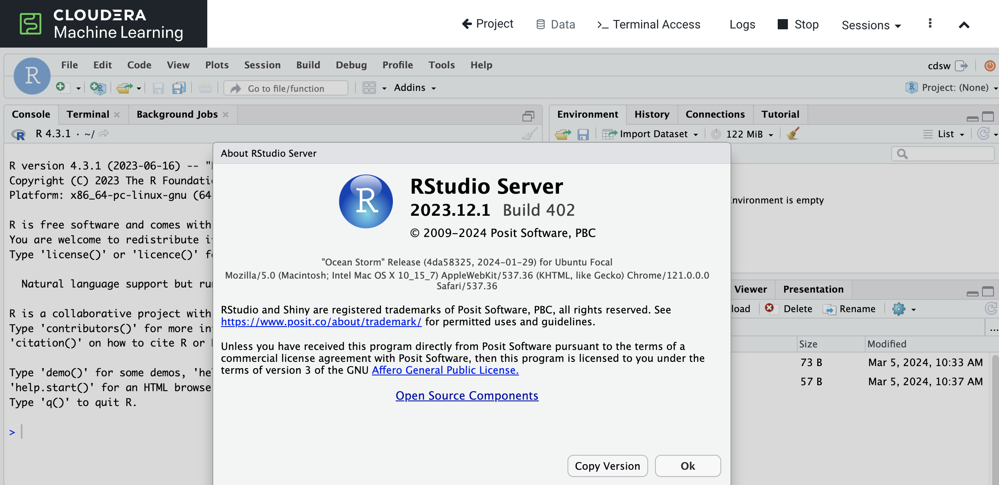

# RStudio Editor for CML Runtimes

This directory contains the scripts needed to build an ML Runtime that uses RStudio 2023.12.1-402 as the editor in Cloudera Machine Learning (CML). It uses PBJ Workbench R4.3 image as the base image for the docker build. 

A prebuilt version has been upload to the Github Container Registry and is available here: 

`ghcr.io/ogakulov/rstudio-2023.12:latest`

For more details on this process and how to add this image to CML, please see this Cloudera Community Article:
https://community.cloudera.com/t5/Community-Articles/Using-RStudio-as-an-Editor-with-ML-Runtimes/ta-p/325166

To learn more about managing ML Runtimes in CML consult the official [Cloudera documentation page](https://docs.cloudera.com/machine-learning/cloud/runtimes/topics/ml-runtimes-overview.html).